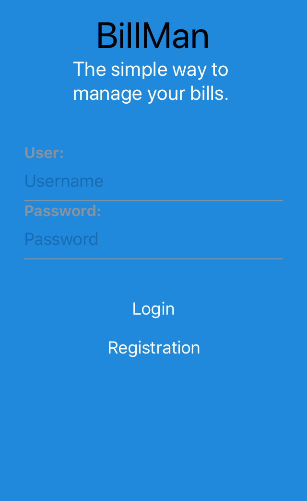
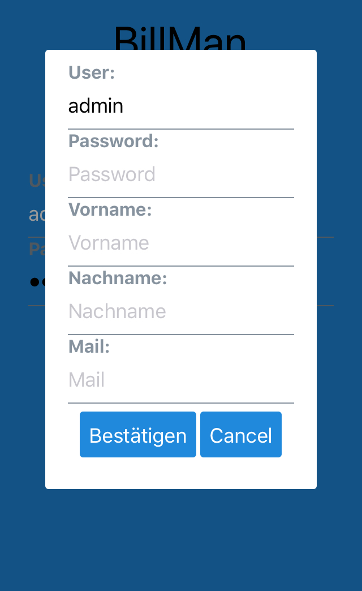
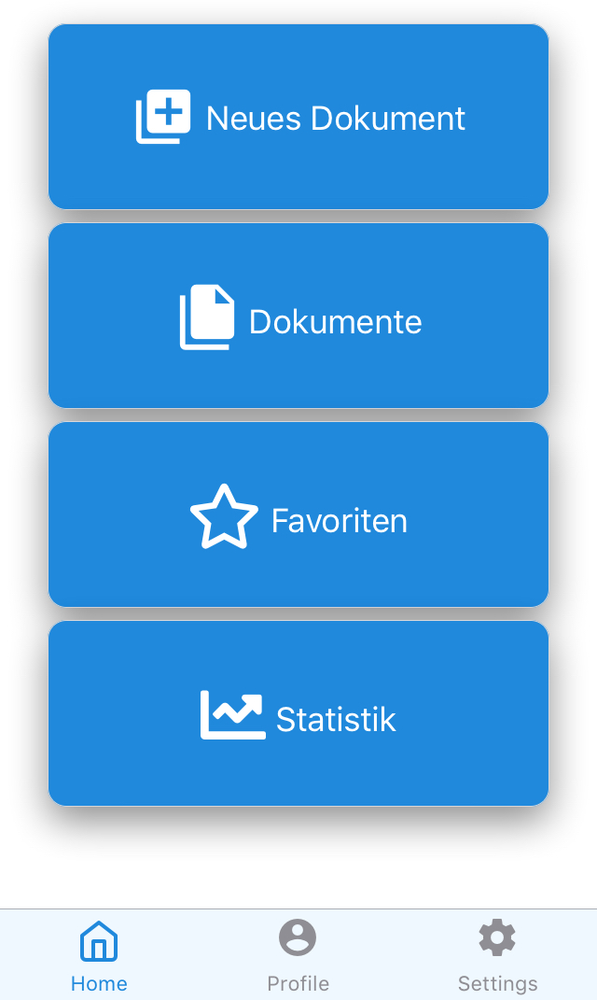
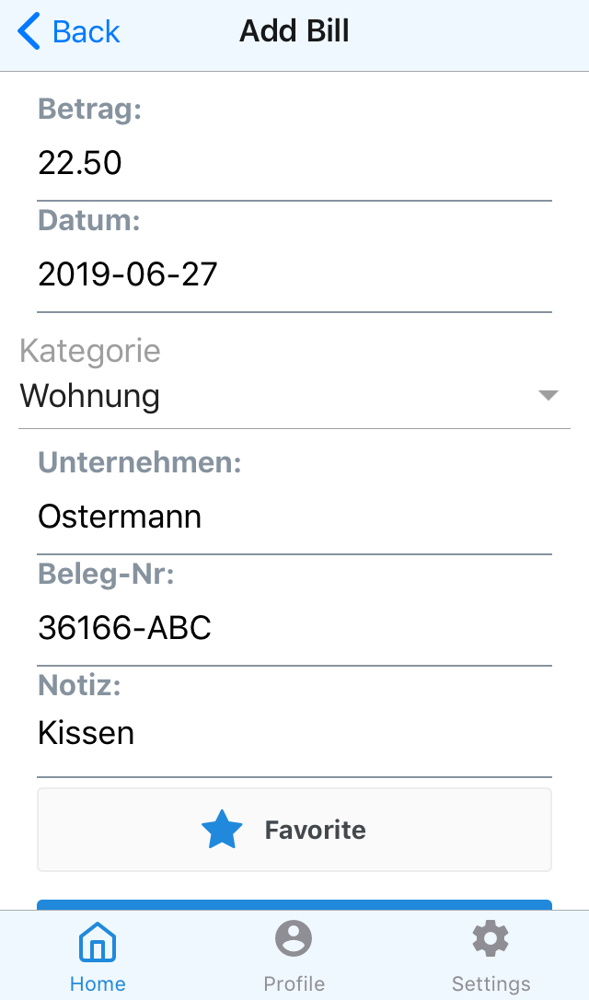
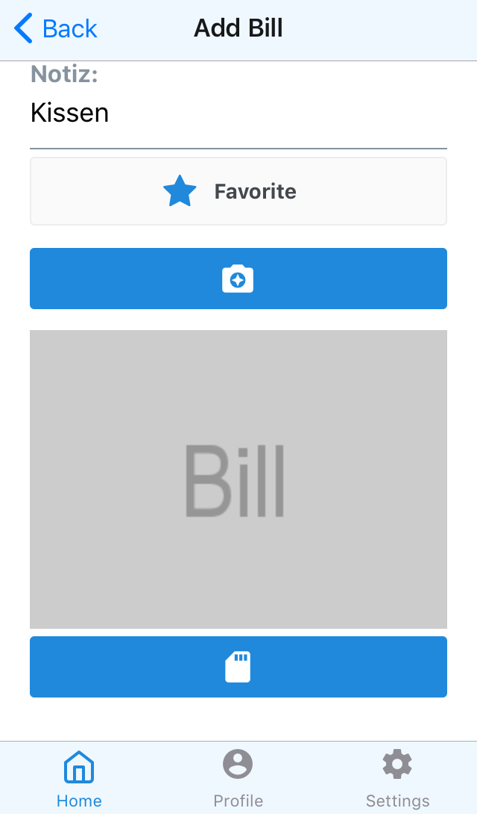
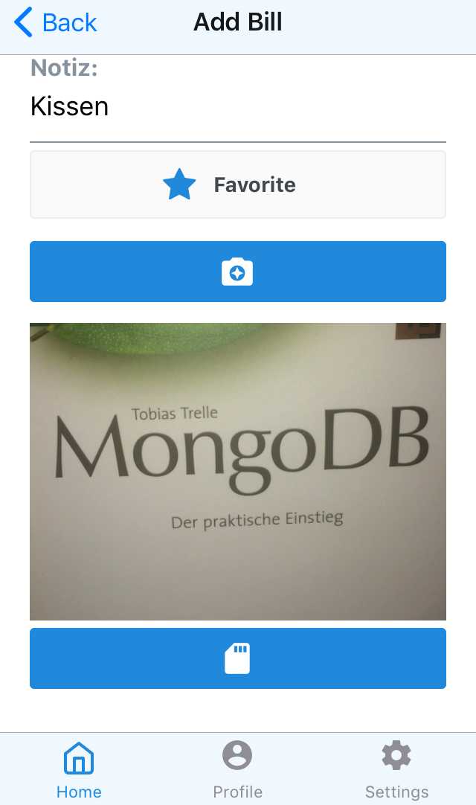
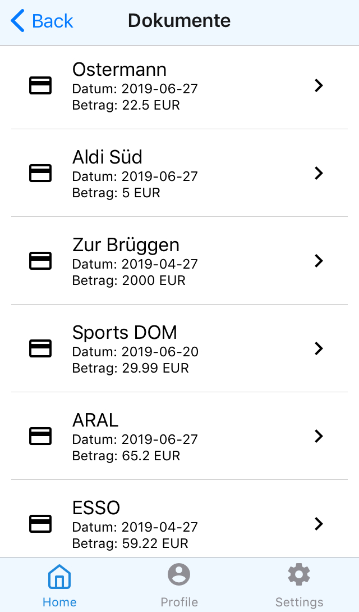
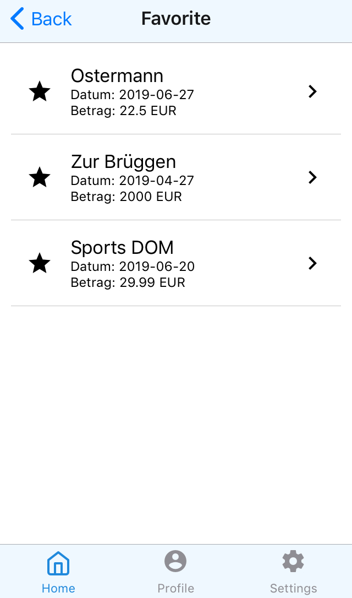
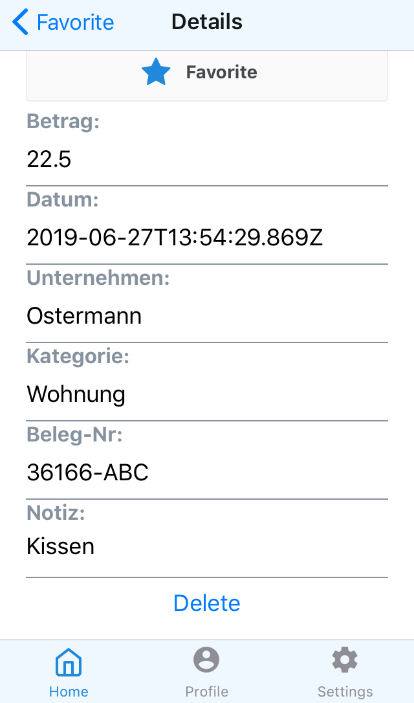
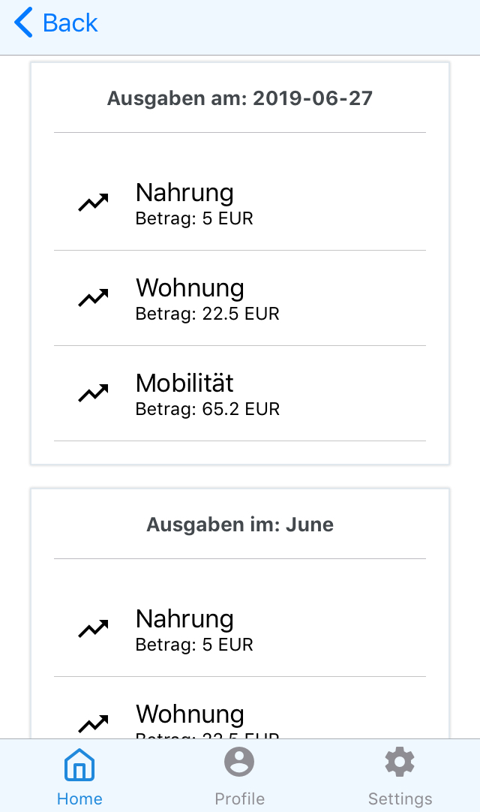

# BillMan
[](https://raw.githubusercontent.com/xotahal/react-native-material-ui/master/LICENSE)

Billman (Bill Manager) makes it easy for the user to manage invoices. With Billman you can capture, save, display and delete invoices. Furthermore, the app offers a favorite function to find documents faster. In addition, the user receives a listing of his expenses grouped by day, month and year.

The project has been realised as part of the course 'Mobile Computing' at Hochschule Ruhr West - University of Applied Sciences by lecturer Michael Schellenbach. 

### Module Requirements

The following guidelines & demands had to be fullfilled to pass the course 'Mobile Computing':
*  Total effort: 50-60 hours
*  Framework: React Native
*  Additional Requirements: Usage of a database (MongoDB) and a webservice (NodeJS) to supply data to the application (or REST API)
*  Releasing the project at gitlab / github
*  Documentation of the project in gitlab / github

## Screenshots












## Getting Started

Make sure you have a package manager like [Yarn](https://yarnpkg.com/lang/en/) or [npm](https://www.npmjs.com) installed. You need also a running [docker](https://www.docker.com/).  

### Prerequisites
To use the application, either an iOS device like an Iphone or an Android device is needed. In addition, the use of the app requires [expo](https://apps.apple.com/de/app/expo-client/id982107779).

### Installing
The project is divided into two components, the frontend and the backend.

### Get Project from Repository

Open your terminal and navigate to a preferred folder where you want to store the Billman project (for example: ~/git/)

Clone this repo:
```
git clone https://gitlab.hs-ruhrwest.de/ynjavogt/billman.git
```
Change to billman dir:
```
cd billman
```

You find two applications in this folder 
* [billman_frontend](/billman_frontend/)
* [billman_backend](/billman_backed/)

## Deployment
### Backend
The Deployment of the backend can be done in two ways.

#### With Docker-Compose

Create a volume for the MongoDB Data
```
docker volume create --name=billmanmongodata
```
Build an run the container with docker-compose
```
docker-compose up
```

#### Start manuelly
Create a images with dockerfile
```
docker build -t billman:latest .
```
Start a MongoDB with external ports and volume mapping
```
docker run -d --name billman_app -p 5021:27017 -v billmanmongodata:/data/db mongo
```
Start a Container which use the created image
```
docker run -p 5015:5015 billman
```

### Frontend

Navigate to the billman_frontend folder
```
cd ~/git/billman/billman_frontend/billman/
```
Installation the required dependencies 
```
npm install
```
Start the app
```
npm start
```

Now you can scan with your device the QR-code. The app is provided via expo.

## Built With

* [React Native](https://facebook.github.io/react-native/docs/getting-started) - The core framework used
* [React Navigation](https://reactnavigation.org/docs/en/getting-started.html) - Navigation Component
* [Expo](https://www.npmjs.com/package/expo) - A free and open source toolchain built around React Native
* [React-Native-Elements](https://www.npmjs.com/package/react-native-elements) - UI-Kit for Design React-Native Apps 
* [react-native-camera](https://github.com/react-native-community/react-native-camera) - A Camera component for React Native
* [Node](https://www.google.com/search?client=firefox-b-d&channel=crow&q=node) - JavaScript runtime built
* [Express](https://www.npmjs.com/package/express) - Web application framework for Node.js
* [Mongoose](https://www.npmjs.com/package/mongoose) - Mongoose is a MongoDB object modeling tool designed to work in an asynchronous environment.
* [MongoDB](https://www.npmjs.com/package/mongodb) - NoSQL Database
  
## Authors

* **Jan Vogt** 

## License

This project is licensed under the MIT License - see the [LICENSE.md](LICENSE.md) file for details