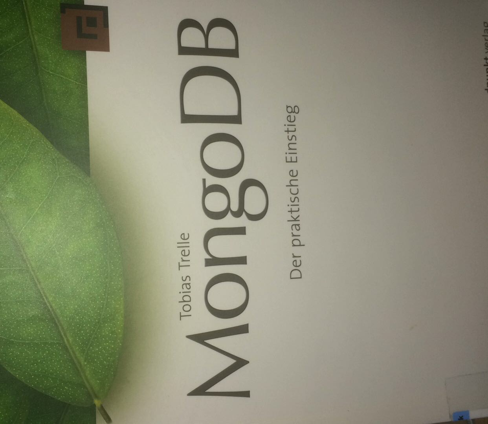
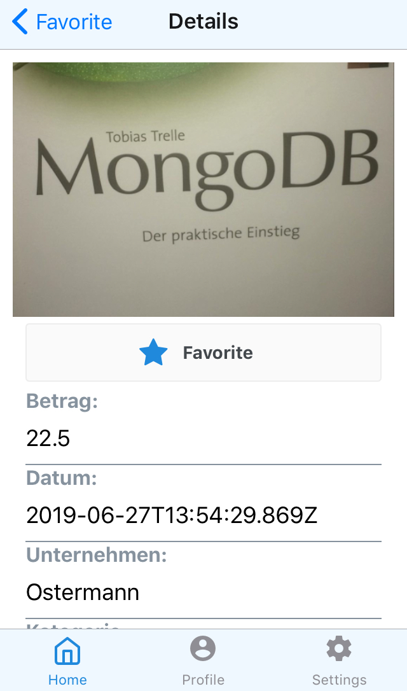

# BillMan

BillMan is an Application which help Users to manage your receipt and save the documents in the cloud. Furthemore the app give a summery about the costs. 

The project has been realised as part of the course 'Mobile Computing' at Hochschule Ruhr West - University of Applied Sciences by lecturer Michael Schellenbach. 

### Module Requirements

The following guidelines & demands had to be fullfilled to pass the course 'Mobile Computing':
*  Total effort: 50-60 hours
*  Framework: React Native
*  Additional Requirements: Usage of a database (MongoDB) and a webservice (NodeJS) to supply data to the application (or REST API)
*  Releasing the project at gitlab / github
*  Documentation of the project in gitlab / github

## Screenshots

## Getting Started

Make sure you have a package manager like [Yarn](https://yarnpkg.com/lang/en/) or [npm](https://www.npmjs.com) installed. You need also a running [docker](https://www.docker.com/).  

### Prerequisites

### Installing

### Setting up xx

## Deployment

## Built With

* [React Native](https://facebook.github.io/react-native/docs/getting-started) - The core framework used
* [React Navigation](https://reactnavigation.org/docs/en/getting-started.html) - Navigation Component

## Authors

* **Jan Vogt** 

## License

This project is licensed under the MIT License - see the [LICENSE.md](LICENSE.md) file for details